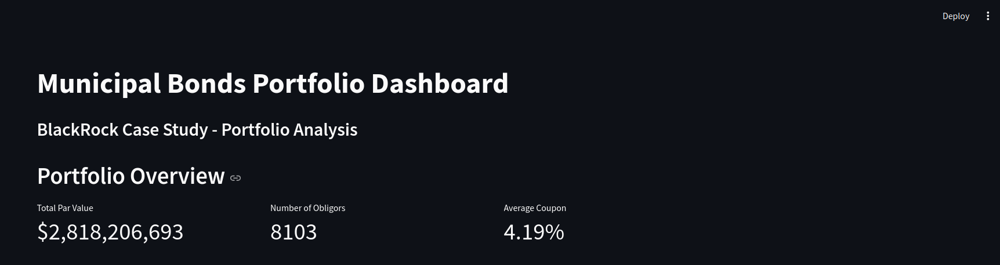
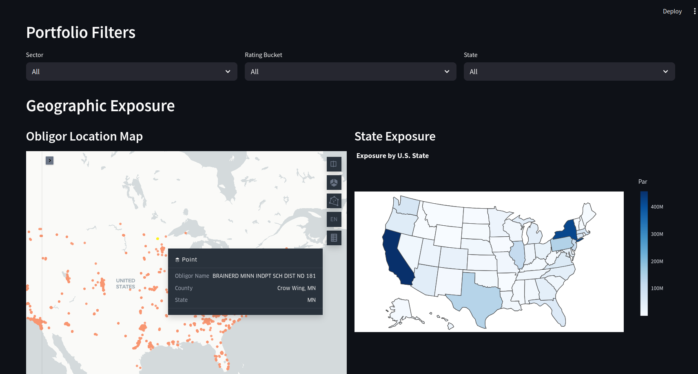

# Municipal Bonds Portfolio Analysis

This project analyzes a municipal bonds portfolio to assess its characteristics and risks. The analysis includes sector distribution, credit risk assessment, rating coverage, outlook distribution, and geographic diversification.

## Dashboard Preview




## Features

- **Portfolio Overview**: Key metrics including total par value, number of obligors, and average coupon
- **Interactive Filters**: Filter by sector, rating bucket, and state
- **Geographic Analysis**: 
  - Interactive map showing obligor locations
  - State-level exposure visualization
- **Data Analysis**:
  - Sector distribution analysis
  - Credit risk assessment
  - Rating coverage analysis
  - Outlook distribution
  - Jump risk identification

## Project Structure

```
.
├── README.md
├── requirements.txt
├── app.py                 # Main Streamlit dashboard
├── data_loader.py         # Data loading utilities
├── visualisations.py      # Visualization functions
├── data/
│   ├── PortfolioX.xlsx
│   └── location_data.xlsx
├── src/
│   ├── analysis/
│   │   ├── sector_analysis.py
│   │   ├── credit_risk_analysis.py
│   │   ├── rating_analysis.py
│   │   ├── outlook_analysis.py
│   │   ├── obligor_analysis.py
│   │   ├── maturity_analysis.py
│   │   ├── jump_risk_analysis.py
│   │   └── geographic_analysis.py
│   └── generate_map.py
└── assets/
    ├── background.webp
    ├── dashboard1.png
    └── dashboard2.png
```

## Setup Instructions

1. Create a virtual environment:
```bash
python -m venv venv
```

2. Activate the virtual environment:
- On Windows:
```bash
.\venv\Scripts\activate
```
- On Unix or MacOS:
```bash
source venv/bin/activate
```

3. Install dependencies:
```bash
pip install -r requirements.txt
```

## Data Files

The project requires two Excel files:
1. `PortfolioX.xlsx` - Contains portfolio position data
2. `location_data.xlsx` - Contains data on obligor locations

Place these files in the `data/` directory.

## Running the Dashboard

To run the Streamlit dashboard:
```bash
streamlit run app.py
```

## Analysis Components

1. **Sector Analysis**
   - Distribution of Par amount across sectors
   - Sector concentration risk assessment

2. **Credit Risk Analysis**
   - Rating distribution (AAA, AA, A, BBB, HY)
   - Rating coverage analysis
   - Outlook distribution

3. **Geographic Analysis**
   - Interactive map of obligor locations
   - State-level exposure analysis
   - Geographic concentration risk

4. **Portfolio Metrics**
   - Total Par Value
   - Number of Obligors
   - Average Coupon
   - Jump Risk Exposure

## Technologies Used

- Python 3.10+
- Streamlit
- Pandas
- Plotly
- Kepler.gl
- Matplotlib/Seaborn
